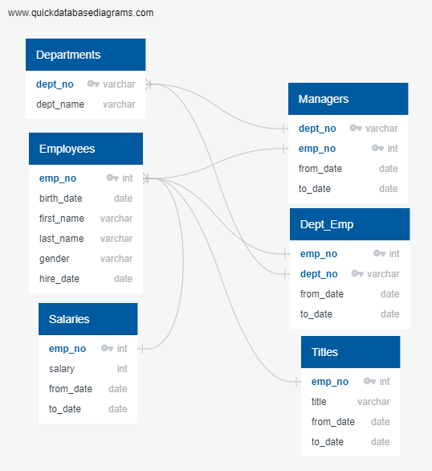
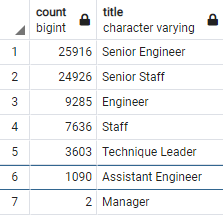
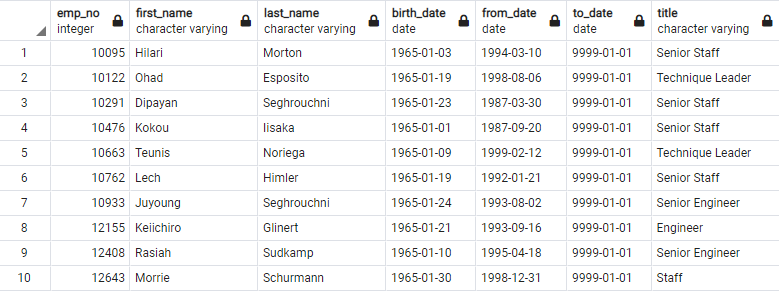
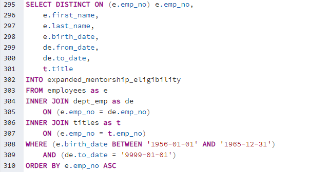
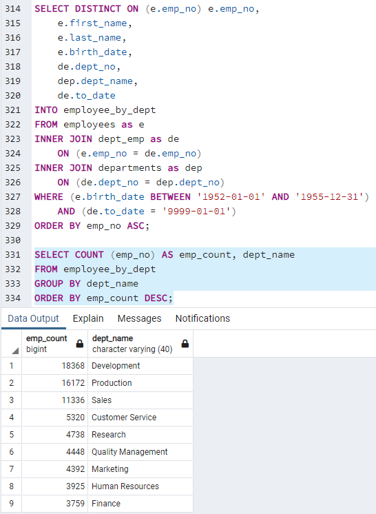

# Pewlett-Hackard-Analysis

## Overview

We initiated this analysis project to sort data into more easily analyzed groupings so that employer Pewlett Hackard could determine how many of their employees were approaching retirement. This information is important as it will give Pewlett Hackard the ability to properly plan on how many new employees need to be hired to maintain a proper workforce. We were first given several CSV files containing seperated information concerning employees, departments, managers, salaries, and job titles. We were able to link this information together through shared primary keys, as shown in the image below.

Connecting all of this information together to form a bigger picture of total employee information allowed us to more accurately report how many employees total were retiring. At Pewlett Hackard, a total of 72,458 employees are currently eligible for or are approaching retirement.

## Results
### Deliverable 1

### Deliverable 2

### Points of Deliverables
* In total, there are 72,458 employees currently eligible for retirement.
* The title that will be in the most dire need of replacements is that of Senior Engineer (25,916 retiring their roles), followed closely by Senior Staff (24,926 retiring their roles).
* There are a total of 1,549 employees eligible for the Mentorship Program per the perimeters set by the company. 
* At this rate, each "mentor" would have to take on 47 people each to train -- while only working part time. This would not be feasible and I would encourage Pewlett Hackard to adjust their plans for training new staff. 

## Summary
### Question 1
How many roles will need to be filled as the "silver tsunami" begins to make an impact?

It was found that 72,458 roles will need to be filled in order to keep the same work force. This is an extremely substantial number and Pewlett Hackard will need to act quickly in order to initiate hiring and training a large number of new employees within a reasonable amount of time.

### Question 2

Are there enough qualified, retirement-ready employees in the departments to mentor the next generation of Pewlett Hackard employees?

No, there is not. Within the perimeters set by the company (filtering for only employees born in 1965), there are only 1549 eligible potential mentors. It is my recommendation that Pewlett Hackard relaxes their perimeters so that those born between 1956 and 1965 can become eligible for the mentorship program. That query will be shown below.

### Additional Query 1

For this query, the previous Mentorship Eligibility query was expanded to include those born between 1956 and 1965. If Pewlett Hackard expanded the perimeters of their Mentorship Program to include those born between 1956 and 1965, it would provide them with 167,666 eligible mentors. They could easily have people work one-on-one with new hires in order to properly train them, and would have plenty of room to accomodate those who do not want to mentor. 

### Additional Query 2

For this query, a new table was created that was a join between the employees, dept_emp, and departments tables. It would be valuable for Pewlett Hackard to know what departments would be in the most need of new hires by showing how many people were retiring per dept. The list was filtered to only include present employees born between 1952 and 1955, and was distinct on employee number so that there would be no duplicates if an employee worked in multiple departments. A count was performed on employee number, grouping by department, to reveal that the department that would be most in need of new employees is the Development dept, with 18,368 employees retiring. 
